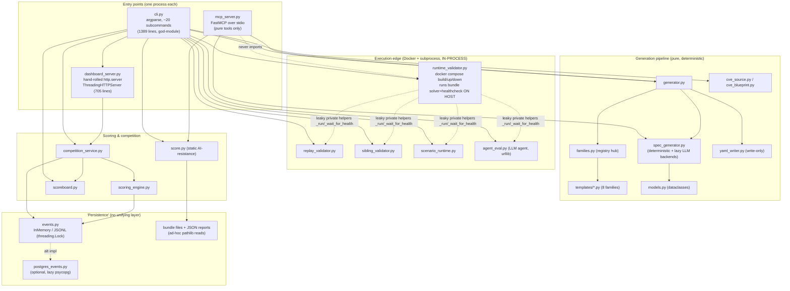

# Current Architecture (Baseline)

> **HISTORICAL (M0 / v0.1.0 baseline).** Describes the pre-platform flat package and the
> divergences the productization refactor set out to fix. Milestones M7–M18 are now shipped;
> for the current layered system see [`overview.md`](overview.md). This document is retained as
> a historical record of the starting point and is no longer an accurate description of the code.

> Milestone 0 baseline. This document describes the system **as it exists today** (v0.1.0)
> and maps its modules onto the planned four-plane target. It **complements** the conceptual
> overview in [`../ARCHITECTURE.md`](../ARCHITECTURE.md) — that document covers the
> "AI proposes, deterministic code builds/validates/scores" principle, the CVE provenance
> model, the generated-bundle trust boundary, and the persisted-report envelope. This
> document does **not** restate those; it focuses on the **runtime shape, process/module
> topology, and boundary violations** that the productization refactor must address.

## 1. One-line summary of today's shape

A single Python 3.11 package (`src/ctf_generator/`, ~35 flat modules, stdlib-only core) with
**no persistence tier and no process boundaries**. Every capability — deterministic generation,
static validation, Docker-backed runtime validation, scoring, a competition dashboard, an MCP
tool server — runs **in one process**, invoked directly by CLI subcommands in `cli.py`. Docker
container builds and untrusted bundle-code execution happen **in-process**, called inline from
validator modules. There is no worker boundary, no domain/application/infrastructure separation,
and no database of record (an optional Postgres event store exists but nothing else is persisted
to it).

## 2. Component diagram (today)

### Runtime facts grounding the diagram

| Concern | Today | Source |
|---|---|---|
| Process model | Single process per invocation; no daemon except `serve` | `cli.py` dispatch |
| Persistence tier | None of record; event log is in-memory/JSONL, optional Postgres | `events.py`, `postgres_events.py` |
| Execution isolation | `docker compose` + bundle `solver.py`/`healthcheck.py` run **on host with caller privileges** by default (`--sandbox` opt-in) | `runtime_validator.py`, `validate-runtime` |
| Dashboard | Hand-rolled `ThreadingHTTPServer`, own session/token/cookie/routing code, inline HTML (no CDN) | `dashboard_server.py`, `dashboard_ui.py` |
| Event store | `InMemoryEventStore` (default) or `JsonlEventStore` (`serve --events-file`); both lock-serialized `seq` | `events.py`, `serve` |
| Config parsing | `challenge.yaml` re-parsed by regex/line-scan (write-only YAML emitter, no reader) | `yaml_writer.py`, `validator.py`, `families.py` |
| MCP safety | Pure tools only; module **never imports** `runtime_validator`, `scenario_runtime`, `agent_eval`, `dashboard_server`, or `subprocess`; CVE snapshot-only | `mcp_server.py` |

The MCP interface is the **one place** that already respects the highest-priority boundary
(no Docker/host-exec reachable from a model host). Every other execution path is CLI-only and
runs inline.

## 3. Divergence from target four-plane architecture

The target (see plan facts / `../ARCHITECTURE.md` roadmap) splits the system into
`domain / application / infrastructure / interfaces / workers` with strict dependency rules.
Today the codebase is **flat**: there is no such layering, and several modules straddle
multiple target layers at once.

### 3.1 Module → target-layer mapping

| Current module(s) | Target layer | Notes |
|---|---|---|
| `models.py` | **domain** | Already close: pure dataclasses, imports only `__version__`. Foundation type layer. |
| `families.py`, `templates/*.py` | **domain** (family SDK/plugin) | Registry + renderers are pure, but `families.py` is a central import hub with a manual circular-import contract; template purity is convention-only. |
| `spec_generator.py` (deterministic core), `cve_blueprint.py`, `scenario.py`, `scoreboard.py`, `scoring_engine.py`, `validator.py`, `score.py` | **domain** / **application** | Pure logic today; needs splitting into domain rules vs. application use-cases. |
| `generator.py` | **application** | Orchestrates a generation use-case; should become a thin application service. |
| `competition_service.py` | **application** | Stateful service over event log + scoring; closest existing thing to an application service. |
| `cli.py` (arg parsing) | **interfaces** (CLI adapter) | Should shrink to arg-parse-only; today it inlines use-case logic (see 3.2). |
| `mcp_server.py` | **interfaces** (MCP adapter) | Already a thin adapter over pure functions; the model for what other interfaces should look like. |
| `dashboard_server.py`, `dashboard_ui.py` | **interfaces** (web/API adapter) | Target replaces the hand-rolled `http.server` with a maintained ASGI framework (planned). |
| `report_writer.py`, `report_index.py` | **infrastructure** (artifact store) | Ad-hoc file writes/reads; target = artifact-storage interface (local-FS/S3), content-addressed. |
| `events.py`, `postgres_events.py` | **infrastructure** (persistence) | Target = PostgreSQL domain model behind a repository abstraction (planned). |
| `cve_source.py` (NVD/cache), LLM backends in `spec_generator.py`/`agent_eval.py` | **infrastructure** (adapters/ports) | Optional deps reached lazily per-module; no unified adapter seam. |
| `runtime_validator.py`, `replay_validator.py`, `sibling_validator.py`, `scenario_runtime.py`, `agent_eval.py` | **workers** (Execution Plane) | **The largest divergence.** These build images and run untrusted bundle code; target isolates them on separate worker hosts, results flowing back via explicit job-result contracts. |

### 3.2 Biggest boundary violations (must fix in refactor)

1. **Execution lives in the control plane / same process.**
   `runtime_validator._run` shells out to `docker compose` and executes bundle-shipped
   `solver.py`/`healthcheck.py` **on the host by default** (`sandbox=True` is opt-in). This is
   invoked inline from CLI subcommands (`validate-runtime`, `replay`, `validate-siblings --runtime`,
   `run-scenario --runtime`, `eval-agent`). *Target invariant:* the control plane **never** mounts
   the Docker socket and **never** executes generated workloads; all of this moves to isolated
   workers (Execution Plane).

2. **Business logic in `cli.py` and dashboard route handlers.**
   `cli.py` (1389 lines) imports nearly every subsystem and inlines use-case orchestration —
   spec building, override application, report writing, threshold checks — directly in argparse
   handlers. `dashboard_server.py` similarly hand-rolls routing/session/scoring wiring in HTTP
   handlers. *Target rule:* no business logic in arg parsers or route handlers; CLI and API share
   one set of application services (as `mcp_server.py` already partially demonstrates).

3. **No worker boundary; execution helpers are leaky.**
   `replay_validator`, `sibling_validator`, `scenario_runtime`, and `agent_eval` each independently
   reach into `runtime_validator`'s **private** helpers (`_run`, `_record`, `_wait_for_health`).
   There is no job contract, no queue, no lease/heartbeat/retry model. *Target:* a
   PostgreSQL-backed job system (`FOR UPDATE SKIP LOCKED`, leases, heartbeats, idempotency keys,
   dead-letter) dispatching to workers that never touch competition-domain state directly.

4. **No persistence layer / repository abstraction.**
   State is scattered: JSONL append log (`events.py`, bare `threading.Lock`), an alternate
   `postgres_events.py`, and per-bundle `variant.json` / report JSON read ad hoc via `pathlib`.
   An `EventStore` Protocol exists for events but nothing unifies challenge/run/report persistence.
   *Target:* PostgreSQL as system of record behind repository interfaces the application layer
   depends on; immutable, content-addressed published artifacts.

5. **Hand-rolled infrastructure substituting for ecosystem tooling.**
   `dashboard_server.py` (bespoke `ThreadingHTTPServer` + session/token code) and `yaml_writer.py`
   (write-only emitter, forcing regex re-parsing of `challenge.yaml` in `validator.py`/`families.py`).
   *Target:* maintained ASGI framework + a real YAML reader / Pydantic-style validation.

6. **Fragmented, advisory-only schema versioning.**
   Three independent hard-coded `"1.0"` constants (`SPEC_VERSION`, `SCHEMA_VERSION`, `__version__`)
   with no shared registry, no negotiation, no migration, and **no consumer that reads them**
   (`spec.json`, `variant.json`, the event log, and CVE cache files carry no version field at all).
   *Target (planned, v0.1-alpha):* real schema versioning with an upgrade/migration path
   (Alembic for the DB domain model).

### 3.3 What already aligns

- `models.py` is a clean domain type layer (imports only `__version__`).
- `mcp_server.py` is a genuine thin interface adapter over pure functions and already enforces the
  no-Docker-from-model-host boundary and a filesystem-sandbox workspace root.
- Templates are pure renderers that (by convention) do not import `families`, approximating a
  domain plugin interface.
- The persisted-report envelope (`report_writer.py`, `SCHEMA_VERSION`) gives a consistent artifact
  shape to build the Execution/Evaluation result contracts on.

## 4. Where to read next

- [`../ARCHITECTURE.md`](../ARCHITECTURE.md) — the design principle, CVE provenance/hashing,
  generated-bundle public/private trust boundary, and persisted-report format.
- `../adr/` — architecture decision records.
- `../security/` — security posture documents.
