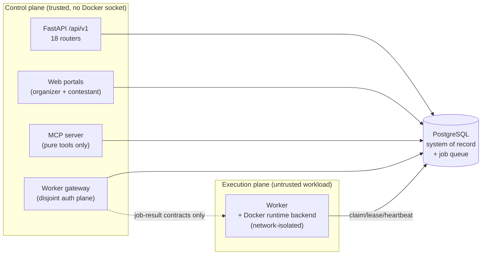

# Architecture Overview (as of M18)

A single readable map of the whole shipped system: the two faces (a deterministic
generator core and a self-hosted platform), the five code layers and the one-way
dependency rule that binds them, the process/trust boundaries between the control
plane and the isolated execution plane, and the subsystems that hang off them. It
is a **map with pointers**, not a restatement of every document — each section links
the authoritative record (an ADR under [`../adr/`](../adr/), a security doc under
[`../security/`](../security/), or a design doc) rather than duplicating it.

For the guiding principle ("AI may propose a challenge, but deterministic code
builds, isolates, validates, and scores it") read [`../ARCHITECTURE.md`](../ARCHITECTURE.md)
first; this document is the structural companion to it.

> The `docs/current-*.md` files and [`current.md`](current.md) in this directory are the
> **M0 / v0.1.0 historical baseline** (the pre-platform flat package). This document
> supersedes them for anyone learning the system as it exists today.

---

## 1. The two faces

CTFGenerator is one codebase with two products layered on top of each other.

**The deterministic generator core.** A pure-Python, stdlib-only engine that turns a
`ChallengeSpec` + seed into a self-contained challenge *bundle* (compose file, service
code, a `public/` player subtree, a `private/` solver/variant subtree). Its defining
invariant is byte-stability: identical `(generator version, spec, family, seed)`
produce identical rendered artifacts, with no wall-clock in the provenance stamp. An
LLM, an MCP host's model, or a live CVE feed may *propose* pedagogical text or theme a
spec, but none of them produce code, routes, flags, or the security-relevant
AI-resistance knobs — the only durable input is the spec plus its seed, and everything
downstream is rebuilt deterministically from that. This core lives in the `domain`
layer (models, family renderers, scoring folds, scenario engine) and is exercised
without any database, HTTP server, or Docker.

**The self-hosted platform.** Wrapped around that core is a multi-process product: a
PostgreSQL system of record, a FastAPI control plane at `/api/v1`, organizer and
contestant web portals, an isolated worker that actually builds and runs the
(untrusted) generated workloads, a PG-backed job queue between them, auth/RBAC,
audit/observability, an artifact store, an evaluation lab, and a supported Docker
deploy stack. The platform never dilutes the core's purity: the generator is called
as pure library code; execution is pushed out to isolated workers.

---

## 2. The five layers and the dependency rule

The package `src/ctf_generator/` is split into five layers with a strict, one-way
dependency rule. This is the **single most important structural fact** about the code.

```
interfaces ──▶ application ──▶ domain ◀── infrastructure
                   ▲                          │
                   └──────────────────────────┘
                     (via domain-defined ports)
workers ──▶ application (+ domain); results flow back only via job-result contracts
```

| Layer | Package | Contains | May depend on |
|---|---|---|---|
| **domain** | `domain/` | Frozen dataclasses + pure business rules: `challenges`, `competitions`, `scoring`, `execution`, `identity`, `auth`, `audit`, `authoring`, `instances`, `ledger`, `scheduling`, `evaluation`, `work`, plus `repositories.py` (port Protocols). **stdlib only** — no http/docker/postgres/mcp/LLM/framework imports. | itself |
| **application** | `application/` | Use-case services + units of work (`identity`, `auth`, `authoring`, `catalog`, `submissions`, `scoring`, `jobs`, `scheduling`, `instances`, `execution`, `evaluation`, `audit`, `backup`, `worker_enrollment`). Orchestrates via domain ports; no concrete IO. | domain, application |
| **infrastructure** | `infrastructure/` | Adapters implementing domain ports: SQLAlchemy ORM + repositories + Alembic migrations (`database/`), the artifact store (`artifacts/`), the JSONL/PG event store, and the Docker runtime backend (`runtime/`). Owns every optional dependency, imported lazily. | domain, infrastructure |
| **interfaces** | `interfaces/` | Thin delivery adapters: the FastAPI app (`api/`), the web portals (`web/`), and the supported CLI (`cli/`). No business logic in handlers. | domain (types), application, infrastructure (wiring root only) |
| **workers** | `workers/` | Isolated job executors (`worker.py`, `eval_runner.py`, the control-plane clients). Results return only via job-result contracts consumed by an application use-case; workers never write competition-domain state directly. | domain, application, infrastructure (wiring root only) |

The rule is not aspirational — it is **statically enforced** by
`tests/test_architecture_boundaries.py`, which parses every module's imports and fails
CI on any forbidden edge (an upward import, a cross-layer violation, or an IO/framework
import inside `domain`). The complete allowed-imports matrix, the per-layer ban lists,
and the enforcement algorithm are specified in
[`dependency-rules.md`](dependency-rules.md); the package-boundary decision is recorded
in [ADR-005](../adr/005-package-dependency-boundaries.md). The persistence design
(ORM/mapper/repository split, immutability triggers) is in
[`persistence-design.md`](persistence-design.md) and
[ADR-002](../adr/002-postgresql-persistence.md) / [ADR-006](../adr/006-persistence-schema-and-immutability.md).

---

## 3. Process and trust boundaries

The layers are a compile-time discipline; the process split is the **runtime security
boundary**. The platform runs as separate processes with an asymmetric trust
relationship.



**Control plane (FastAPI `/api/v1`).** The `interfaces/api/` app (created by
`app.py`'s factory) exposes 18 routers — competitions, teams, users, auth, oidc,
challenge-definitions, challenge-versions, builds, publications, instances, jobs,
submissions, scoreboard, evaluations, artifacts, audit, system, plus the
plane-isolated worker gateway. It is the trusted tier
and holds the invariant that makes the whole design safe:
**it never mounts the Docker socket, never accesses BuildKit, and never imports an
execution module** ([REQ-INV-010](../REQUIREMENTS.md); the control-plane/execution-plane
split is [ADR-001](../adr/001-control-plane-execution-plane-boundary.md)). It schedules
work by writing rows to the job queue, never by running anything itself.

**Isolated worker (execution plane).** `workers/worker.py` is the only process that
executes generated (therefore untrusted) workloads. It drives the Docker runtime
backend (`infrastructure/runtime/docker_backend.py`) under a network-isolated,
capability-restricted policy. The rootless/isolation posture and its host-dependent
enforcement floor are documented in
[`../security/runtime-isolation.md`](../security/runtime-isolation.md) and
[ADR-004](../adr/004-rootless-container-runtime.md).

**The job queue between them.** A PostgreSQL-backed queue (`FOR UPDATE SKIP LOCKED`
claim, leases, heartbeats, retries, idempotency keys, dead-letter) is the *only*
channel from the control plane to a worker. A worker claims a job, runs it in
isolation, and returns a job-result contract; the control plane applies that result
through an application use-case — a worker never writes competition-domain state
directly. Design record: [ADR-003](../adr/003-postgres-backed-job-queue.md).

**The worker gateway.** `interfaces/api/worker_gateway/` is the HTTP surface a remote
worker talks to. Its authentication plane is **disjoint** from the human auth plane:
worker identity comes only from a scoped worker credential, never from a user session,
so a compromised worker cannot act as a person and vice versa.

**The MCP firewall.** `mcp_server.py` exposes only pure, side-effect-bounded tools
(list/build/validate/score/report). It **never imports** `runtime`, execution, or
`subprocess`, resolves all writes under a workspace sandbox, and is CVE-snapshot-only —
the same "no execution reachable from a model host" boundary the control plane holds,
applied to the model-facing surface.

---

## 4. Subsystems

Each of these is a slice through the layers (a domain aggregate + application service +
infrastructure adapter + interface surface), reachable from the map above.

**Auth / RBAC / OIDC.** Local password auth with server-side sessions, per-competition
role scoping and team tenancy, and denied-attempt auditing. Federated login is
OIDC authorization-code + PKCE against an external IdP. Records:
[ADR-007](../adr/007-authentication-and-sessions.md) (auth + sessions),
[ADR-008](../adr/008-oidc-federation.md) (OIDC), and
[`../security/oidc.md`](../security/oidc.md). Code: `domain/auth`, `domain/identity`,
`application/auth`, `application/identity`, `interfaces/api/routers/{auth,oidc,users}.py`.

**Organizer + contestant web.** Two server-rendered portals under `interfaces/web/`
(organizer studio + the contestant `contestant.py` view), with CSRF protection and
browser-bound sessions, calling the same application services as the API.

**Audit + observability.** Every privileged state change becomes a durable,
**append-only, tamper-evident** `AuditEvent`: WHO did WHAT to WHICH resource, secret-free
by construction, protected by a shared BEFORE-UPDATE-OR-DELETE `reject_mutation` trigger
so a row can never be silently altered or removed. Structured JSON logging and a
secret-redaction seam live in `observability/`. Read surface: `interfaces/api/routers/audit.py`.

**Artifact store (public/private separation).** Published challenge versions are
materialized once — render, then **strip the `private/` subtree** — and the public
bytes are persisted (`infrastructure/artifacts/`). `ArtifactDownloadService`
(`application/authoring/artifact_download.py`) is the single resolver of public bundle
bytes: it serves only the already-stripped public tar and reaches private files through
no code path, so there is no traversal surface.

**Evaluation lab.** A *measured* agent-eval subsystem (`domain/evaluation`,
`application/evaluation`, `workers/eval_runner.py`) that runs a tool-using agent against
a live instance and records an empirical result. This is deliberately **distinct** from
two other "score" concepts, which are advisory:
- `score.py` — the **static AI-resistance heuristic**, a bundle-derived quality *estimate*
  (explicitly advisory; it is never treated as an empirical guarantee).
- `AIResistanceWeightedEngine` (`"ai_resistance"` in `domain/scoring/scoring_engine.py`)
  — a competition scoring engine that applies an **advisory per-challenge weight
  multiplier** to points.

Keep these three straight: the eval lab *measures*, the static heuristic and the
`ai_resistance` multiplier *estimate/weight*.

**Backup / restore / DR.** Application-level backup + verification
(`application/backup/`) plus the operational runbook in
[`../operations/backup-recovery-upgrade.md`](../operations/backup-recovery-upgrade.md).

**Deploy stack.** A supported Docker deployment: `deploy/` ships `Dockerfile.api`,
`Dockerfile.worker`, `docker-compose.yml`, an entrypoint, and `verify-deploy.sh`;
hosting guidance is in [`../HOSTING.md`](../HOSTING.md) and configuration in
[`../operations/configuration.md`](../operations/configuration.md).

---

## 5. Where to read next

- **Principle & provenance** — [`../ARCHITECTURE.md`](../ARCHITECTURE.md).
- **Layer rules (enforced)** — [`dependency-rules.md`](dependency-rules.md); test at
  `tests/test_architecture_boundaries.py`.
- **Persistence** — [`persistence-design.md`](persistence-design.md).
- **Decision records** — [`../adr/`](../adr/) (001–008) are the authoritative design
  records for every boundary named above.
- **Security posture** — [`../security/`](../security/): threat model, runtime
  isolation, secret management, OIDC, incident response, responsible disclosure.
- **Requirements & invariants** — [`../REQUIREMENTS.md`](../REQUIREMENTS.md)
  (REQ-INV-010 control-plane isolation, and the rest).
- **Historical baseline** — [`current.md`](current.md), [`../current-system.md`](../current-system.md),
  [`../current-cli.md`](../current-cli.md), [`../current-schemas.md`](../current-schemas.md)
  describe the pre-platform M0 shape.
